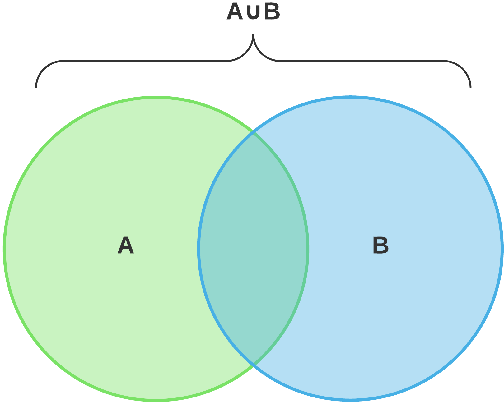

# venn


<p align="center">

</p>


[](https://pkg.go.dev/github.com/ehrktia/venn)


Venn follows unix principle and does only one thing i.e - union and
intersection operations on data sets
To use the pkg run the below command

`go get github.com/ehrktia/venn@latest`

## Union

Combines two data set together into a single set
Union is similar to the mathematical union operation `AUB`
It provides unique results by eliminating duplicates

## Intersection

compares two data sets and extracts the common elements between them similar
Intersection is similar to mathematical set operation `ANB`

## example usage

```
package main

import (
	"fmt"
	"github.com/ehrktia/venn"
)

func main() {
	a := []string{"a", "b", "c"}
	b := []string{"a", "b", "c"}
	v := venn.UnionString(a, b)
	fmt.Printf("%v\n", v)
	i:=venn.IntersectString(a,b)
	fmt.Printf("%v\n", i)

}
```

There are dedicated union and intersection operations available for

- string
- Int
- float64


## performance stats

```
 BenchmarkIntersectString-8         85666             18306 ns/op
 BenchmarkIntersectString-8         68802             14656 ns/op
 BenchmarkIntersectString-8         83733             13640 ns/op
 BenchmarkIntersectString-8         85290             13164 ns/op
 BenchmarkIntersectString-8         86738             12772 ns/op
 BenchmarkIntersectString-8         87987             12915 ns/op
 BenchmarkIntersectString-8         92313             13504 ns/op
 BenchmarkIntersectString-8         85320             12857 ns/op
 BenchmarkIntersectString-8         89677             12985 ns/op
 BenchmarkIntersectString-8         86006             13069 ns/op


 BenchmarkDeDupString-8             10000            103755 ns/op
 BenchmarkDeDupString-8             10000            102127 ns/op
 BenchmarkDeDupString-8             10000            100217 ns/op
 BenchmarkDeDupString-8             12430             94822 ns/op
 BenchmarkDeDupString-8             12348             92181 ns/op
 BenchmarkDeDupString-8             12560             94198 ns/op
 BenchmarkDeDupString-8             12190             93790 ns/op
 BenchmarkDeDupString-8             12916             94538 ns/op
 BenchmarkDeDupString-8             15499             92844 ns/op
 BenchmarkDeDupString-8             12674             88127 ns/op

```


## contributions

This is a open source library , all pull request and feature request are welcome
Thank you in advance for your time and efforts
